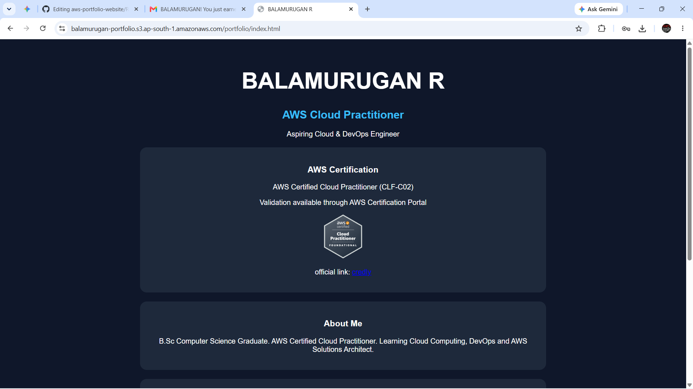
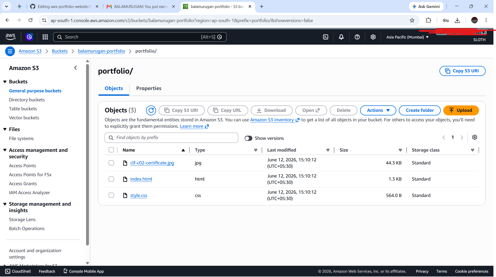

# AWS Portfolio Website

## Project Overview

This project is a personal portfolio website hosted using Amazon S3 Static Website Hosting.

## Live Website

https://balamurugan-portfolio.s3.ap-south-1.amazonaws.com/portfolio/index.html

## AWS Services Used

- Amazon S3
- Static Website Hosting
- Bucket Policy
- Public Access Configuration

## Features

- Personal profile
- AWS Certification section
- Skills section
- GitHub and LinkedIn links

## Project Structure

```
index.html
style.css
clf-c02-certificate.jpg
```

## Screenshots
## Homepage




## S3 Bucket




## Skills Demonstrated

- AWS S3
- Static Website Hosting
- IAM Concepts
- Bucket Policies
- Troubleshooting Access Denied Errors
